# German Power System Analysis
### Demand, Generation & Residual Load (2020–2025)

An end-to-end analysis of Germany's electricity system using hourly data from the ENTSO-E Transparency Platform. The project explores demand patterns, renewable generation trends, and residual load dynamics — key concepts for understanding modern power grids with high renewable penetration.

---

## Highlights

- Hourly data spanning **2020–2025** (~47,000 data points)
- Full data pipeline: loading, cleaning, merging, feature engineering
- **14 visualisations** covering demand, generation mix, and residual load
- Key performance indicators (KPIs) on renewable share and grid flexibility

---

## Visualisations

### Demand Analysis

**Hourly Electricity Demand Time Series**
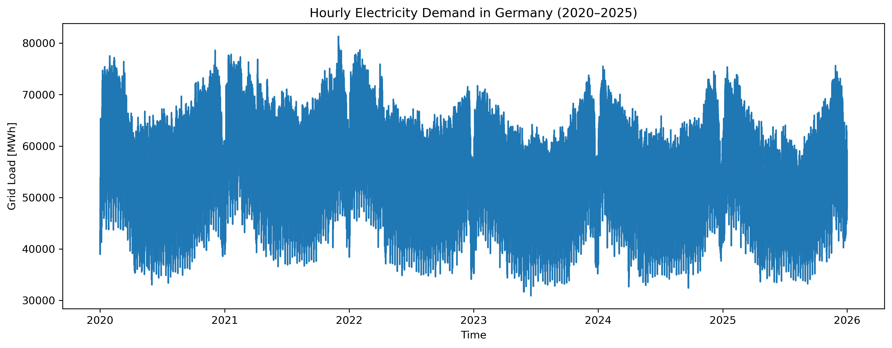

**Average Yearly Demand**
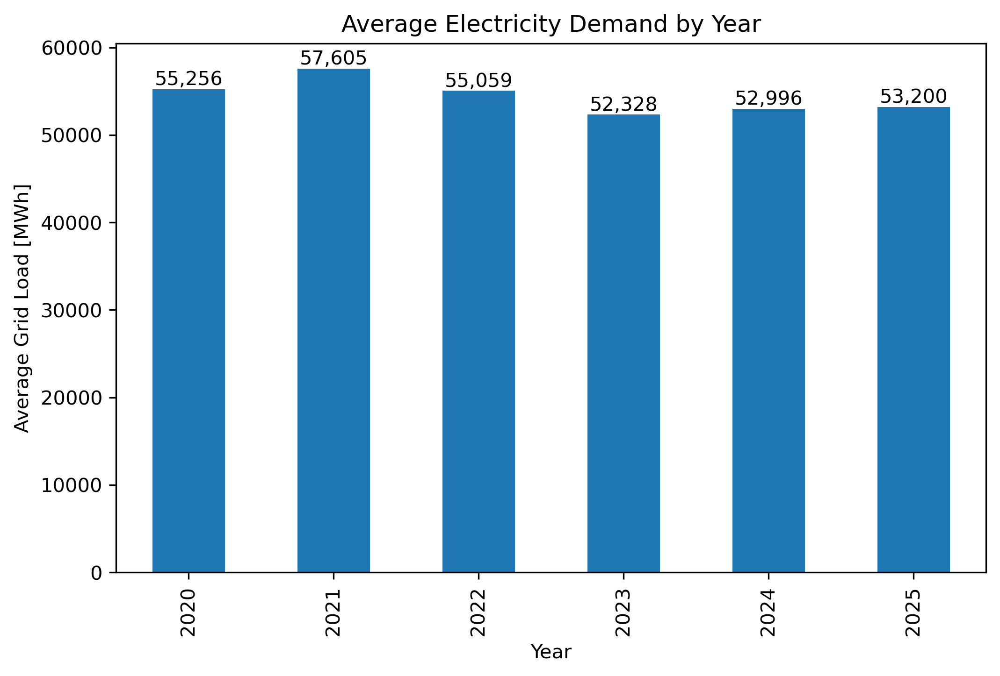

**Average Monthly Demand**
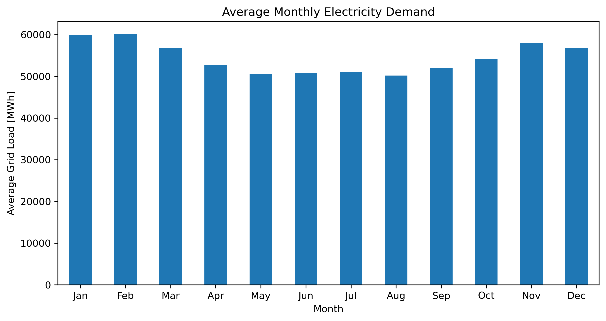

**Average Hourly Demand Profile**
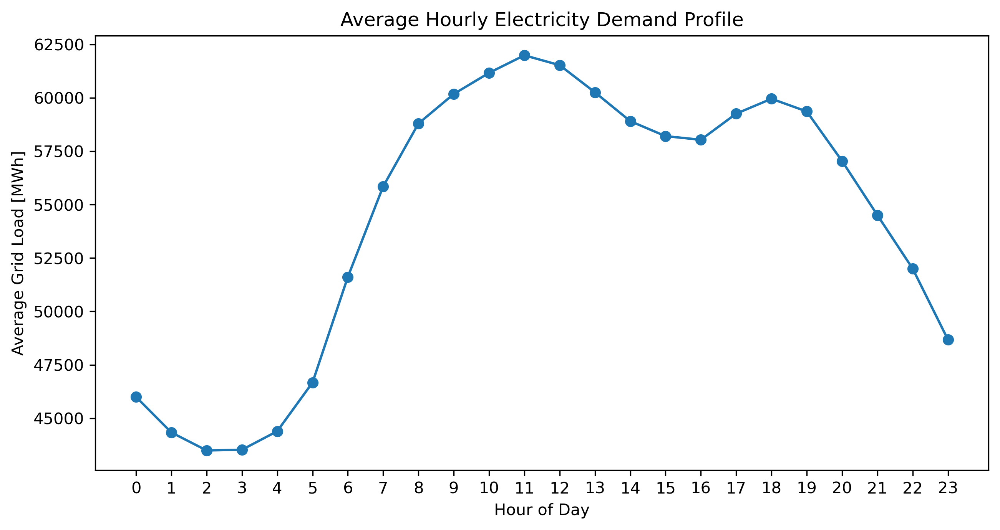

**Weekday vs Weekend Demand**


---

### Generation Analysis

**Yearly Generation Mix (Nuclear / Fossil / Renewable)**
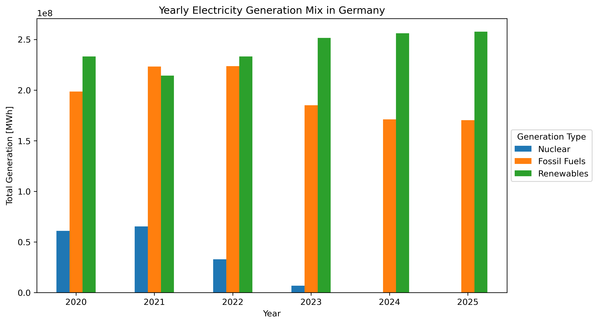

**Renewable Generation Breakdown by Source**
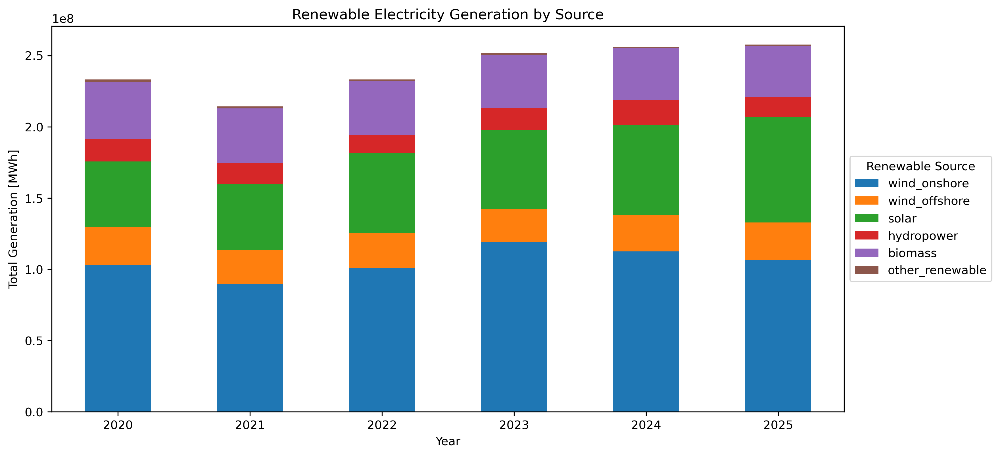

**Seasonal Wind & Solar Pattern**
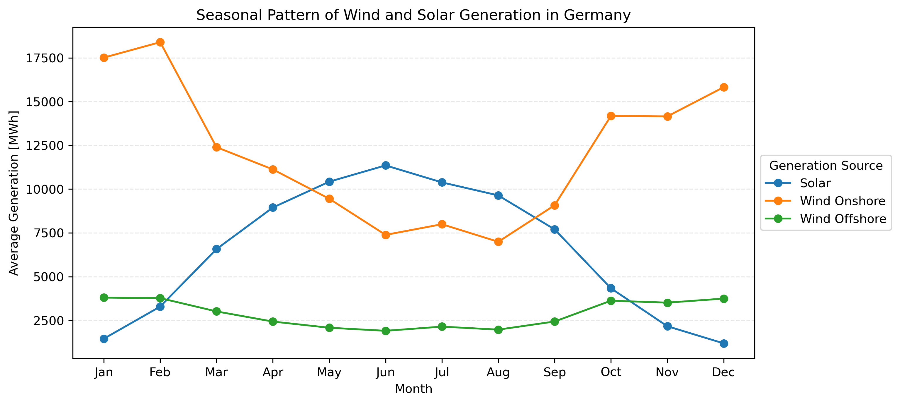

**Renewable Share Over Years**
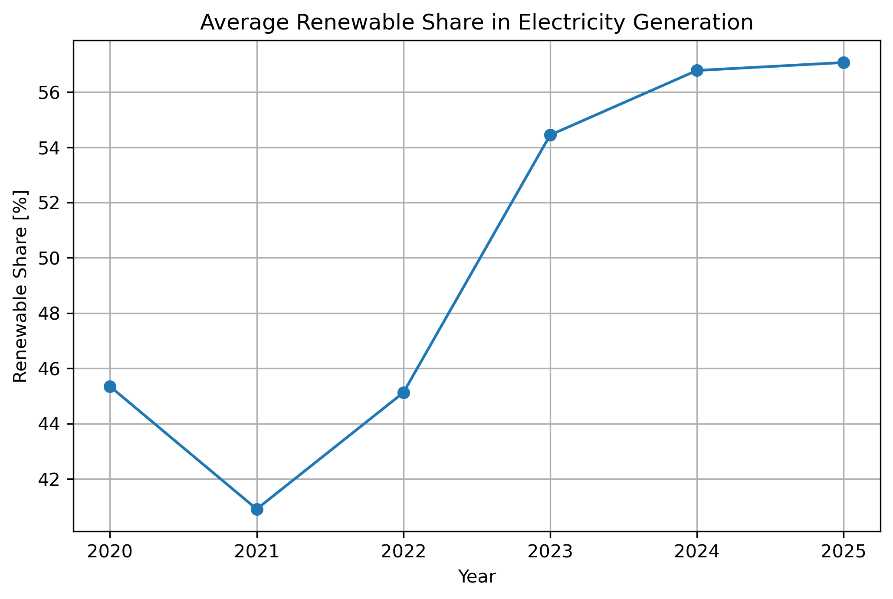

**Monthly Renewable Generation**
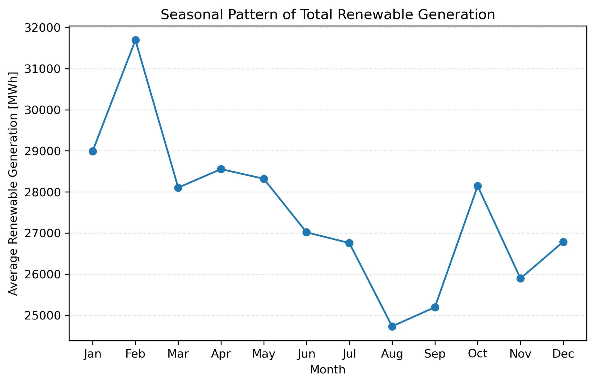

---

### Residual Load Analysis

**Residual Load Time Series**
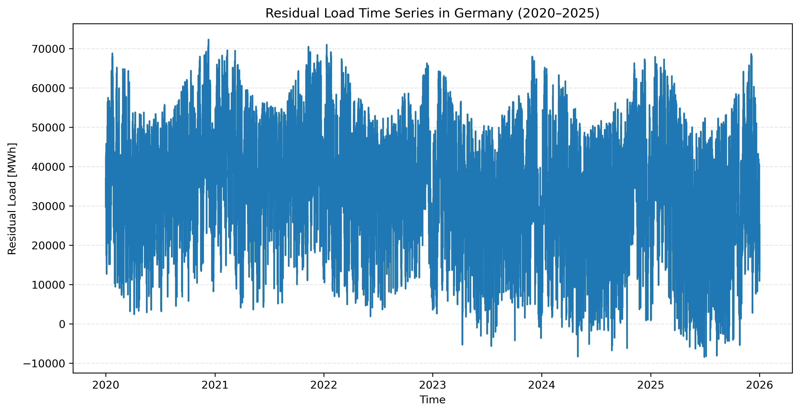

**Duck Curve — High Renewable Day**
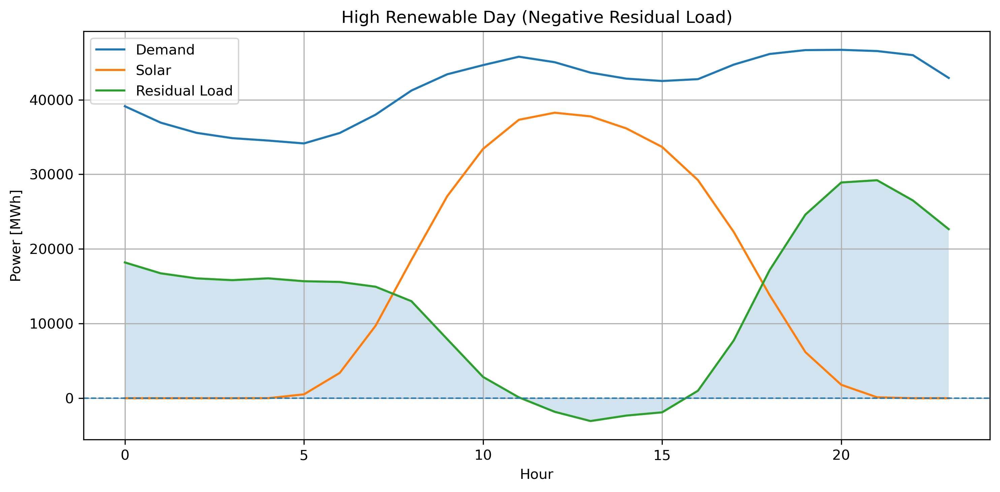

**Duck Curve — Low Renewable Day**
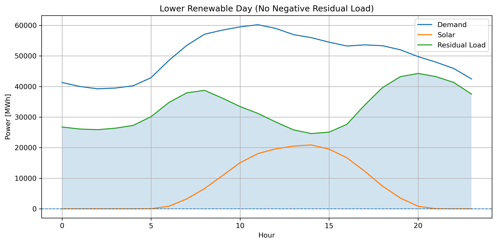

**Residual Load Distribution**
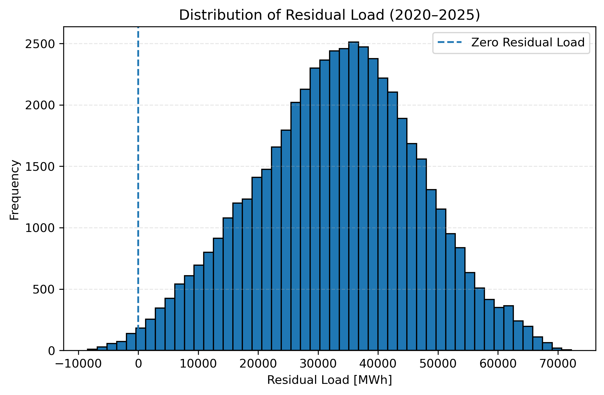

**Negative Residual Load Hours per Year**
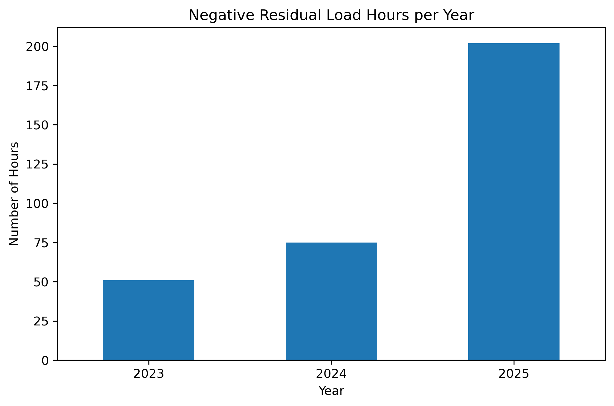

**Residual Load Duration Curve**
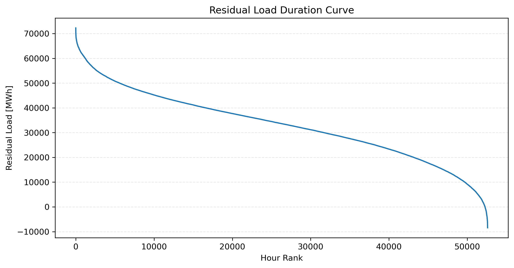

**Residual Load Ramping Distribution**
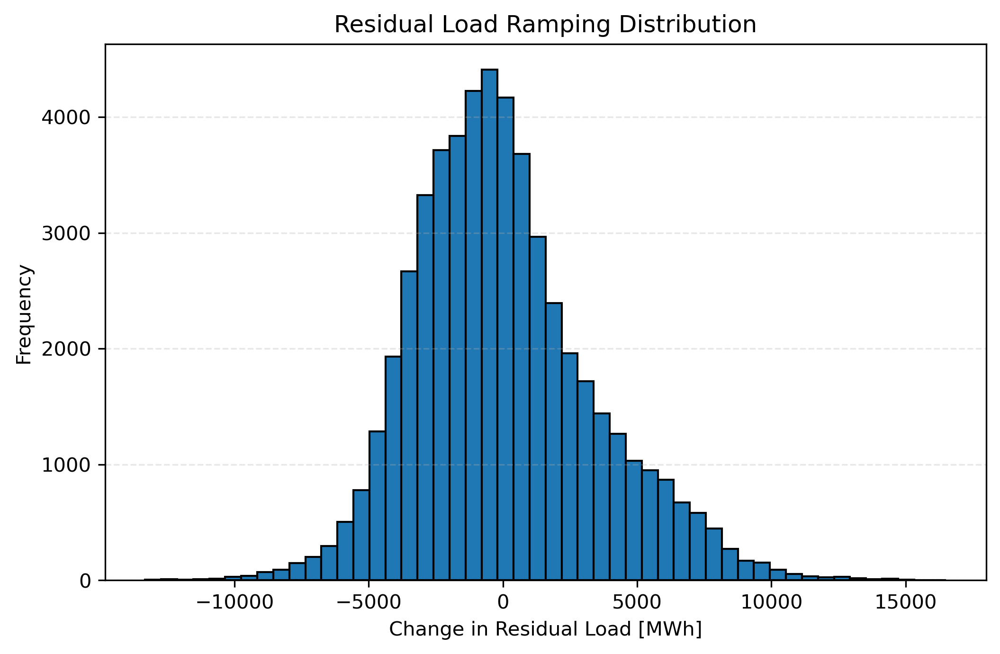

---

## Project Structure

```
├── Deutsche Strom Analyse.py        # Main analysis script
├── data/
│   ├── Electricity Generation.csv
│   ├── Electricity Consumption.csv
│   └── Final_df_Deutsche Strom Analysis.csv
└── outputs/                         # All generated charts (PNG)
```

---

## Requirements

```
pandas
numpy
matplotlib
```

Install with:

```bash
pip install pandas numpy matplotlib
```

---

## Usage

```bash
python "Deutsche Strom Analyse.py"
```

Charts are saved automatically to the `outputs/` directory.

---

## Data Source

Electricity generation and consumption data from the [ENTSO-E Transparency Platform](https://transparency.entsoe.eu/), covering Germany's bidding zone.
